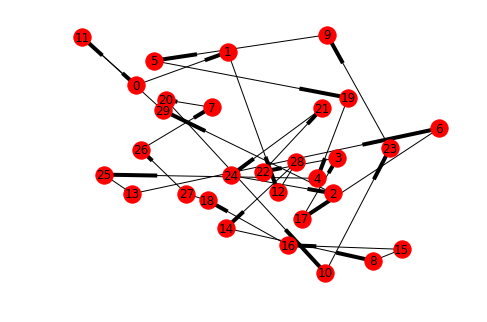

```python
from tsp_GA import Travelling_salesman
% matplotlib inline
```


```python
my_problem = Travelling_salesman(no_of_cities = 30)
my_problem.evolve()
print(my_problem.bst_dist,my_problem.bst_parent)
```

    200.44136625800604 [14, 8, 15, 16, 18, 27, 26, 7, 20, 10, 23, 9, 5, 19, 4, 25, 13, 6, 17, 3, 22, 21, 24, 2, 29, 11, 0, 1, 12, 28]


```python
my_problem.plot_cities()
```




